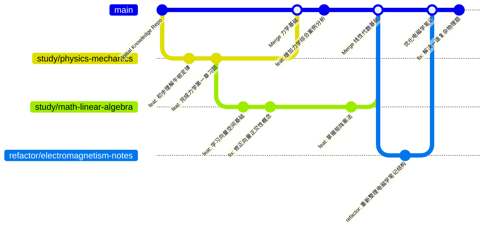

# Git の 正确打开方式：工程师思维赋能学习
## 序言：为什么学习需要“Git”？
在信息爆炸和知识快速迭代的时代，传统的线性、被动学习方式（如简单地阅读、抄写笔记）往往效率低下，难以追踪知识的演进和个人理解的深化。特别对于理科知识，其严谨性、推导过程和概念间的关联性，更需要一种系统化、可追溯的管理方式。  
《Git の 正确打开方式》倡导一种将软件工程中的版本控制思想（Git） 应用于个人知识管理与学习的方法。它将你的学习过程视为一个持续迭代、不断优化的“软件项目”，通过 Git 的核心功能来记录、组织和深化你对知识的理解，从而提升学习效率，培养工程师思维。  
## 一、核心理念：学习即迭代的“项目”
### 1.1 知识即“代码”，理解即“提交”
知识（概念、定理、公式、推导、例题、习题解答） 被视为“代码”或“数据文件”。  
你对知识的每一次理解、消化、整理、修正、补充、完成习题，都被视为一次“提交”（Commit）。  
每一次提交都是你对该知识点理解的一个“版本”，并附带清晰的“提交信息”记录了这次学习的成果和思考。  
### 1.2 学习路径即“分支”，探索即“试错”
你的主要学习路径（如课程大纲、专业核心知识）是主线“分支”（main 或 master）。  
当你需要深入研究某个子课题、尝试不同的解题思路、探索尚未完全理解的概念时，可以开启一个新的“分支”（Branch）。  
分支允许你在不影响主线知识库的情况下进行自由探索和“试错”，所有操作都只发生在当前分支，互不干扰。  
### 1.3 掌握即“合并”，输出即“评审”
当你在一个分支上完成某个主题的学习，并通过练习和自我检查，确认已扎实掌握后，就可以将这个分支“合并”（Merge）到主线分支。这象征着你对该知识点的融会贯通，并将其正式纳入你的核心知识体系。  
合并前的“自我评审”（或与学习伙伴的“代码审查”/Pull Request），是强制你反思、检验知识理解程度的关键环节，确保输出质量。  
### 1.4 云端备份与展示：你的“数字学习履历”
通过将本地的知识仓库同步到 GitHub 等远程平台，你的所有学习成果都能得到安全备份。  
GitHub 仓库也成为了你独特的“数字学习履历”，直观展示你的学习过程、深度和系统性，远比简历上简单的“掌握XX知识”更有说服力。    
## 二、理论基石：为什么这种方法高效？
Git 学习法并非玄学，其高效性来源于对人类学习认知过程和软件工程最佳实践的结合：
- 主动构建理论 (Active Construction of Knowledge)：
每次“提交”和“重构”都强制你用自己的语言组织知识，而非被动接收。这是深度学习的关键。  
大脑在主动加工信息时，神经连接更强，记忆更牢固。  
- 模块化与分解 (Modularity & Decomposition)：
将复杂知识体系分解为小而独立的“文件”和“提交”，降低学习难度，避免压倒感。  
有助于清晰地识别知识边界和相互关系。  
- 版本化与可追溯 (Version Control & Traceability)：
每一次提交都留下学习足迹，你可以随时回溯到某个概念的最初理解、中间的修正、以及最终的掌握状态。  这对于理科知识的推导和概念演进尤为重要。  
有助于发现并纠正思维中的偏差或“Bug”。  
- 迭代与精化 (Iteration & Refinement)：
Git 的分支-合并模型鼓励你持续改进和完善知识。对知识的理解不是一次性的，而是在不断的“提交”和“重构”中螺旋上升。  “修复分支”让你能专门针对某个理解误区进行深入修正，而不影响整体学习流程。  
- 输出驱动与反馈 (Output-Driven & Feedback Loop)：
“提交”本身就是一种强制的输出行为。  
“合并前的自我评审”或“Pull Request 思维”提供了内在的反馈机制，促使你检查理解的严谨性和准确性。  
- 工程师思维训练 (Engineering Mindset Training)：
在学习知识的同时，无形中培养了你严谨的逻辑思维、系统设计能力、版本管理能力、问题定位与解决能力，这些都是未来作为一名软件工程师的核心素养。
## 三、操作指南：手把手教你实践
### 3.1 准备阶段 (Setup)
安装 Git： 访问 Git 官网 下载并安装 Git。  
安装代码编辑器： 强烈推荐 VS Code。  
安装 Python 插件 (如果你学习 Python 相关)。  
安装 Markdown All in One / Markdown Preview Enhanced 等插件，方便 Markdown 预览和 LaTeX 公式显示。  
安装 LaTeX Workshop 等插件 (如果你使用 LaTeX 撰写笔记)。  
注册 GitHub 账号： 访问 GitHub 官网 进行注册。  
### 3.2 建立你的“知识仓库” (Initialize Repository)
在本地创建项目文件夹： 例如，在你的电脑上创建一个名为 MyKnowledgeRepo/ 的文件夹。  
初始化本地 Git 仓库： 打开终端或 VS Code 的集成终端，进入 MyKnowledgeRepo/ 文件夹，执行命令：  
```Bash
git init
```
这会在 MyKnowledgeRepo/ 文件夹下生成一个隐藏的 .git 文件夹，Git 的“大脑”就此诞生。  
在 GitHub 上创建远程仓库：  
登录 GitHub。  
点击右上角 + 号 --> New repository。  
填写仓库名称（例如 MyKnowledgeRepo），选择 Public (公开) 或 Private (私有)。  
不要勾选 “Add a README file”、“Add .gitignore”、“Choose a license”，我们会在本地手动创建。  
点击 Create repository。  
关联本地仓库与远程仓库： 在你的本地终端，复制 GitHub 页面上提供的远程仓库 URL（通常是 https://github.com/你的用户名/MyKnowledgeRepo.git），执行：
```Bash
git remote add origin https://github.com/你的用户名/MyKnowledgeRepo.git
```
**origin**是远程仓库的别名，可以自定义，但通常都用 origin  
首次提交基础文件并推送到 GitHub： 在 MyKnowledgeRepo/ 文件夹下创建以下文件：  
README.md：用 MarkDown 写下你的学习宣言、知识库概览。  
LICENSE：选择一个开源许可证（如 MIT License），从网上复制模板内容  
.gitignore：忽略不需要提交的文件类型，例如：# 学习过程中产生的临时文件、编译产物*.aux*.log*.blg*.out# IDE 或编辑器配置文件.vscode/.idea/*.swp  
然后执行：
```Bash
git add .git commit -m "feat: Initialize my knowledge repository with README, LICENSE, and .gitignore"
git push -u origin main
 # -u 参数会设置 main 分支的默认上游分支，以后可以直接 git push 或 git pull至此，
```
你的知识仓库就建立完毕，并同步到了 GitHub。  
### 3.3 日常学习操作流程
创建学习分支 (开始一个新专题/章节的学习)：当你开始学习一个新的章节或一个独立的知识点时，从 main 分支拉出一个新分支。
```Bash
git checkout main # 确保你在主分支
git pull origin main # 同步主分支最新内容 (防止冲突)
git checkout -b study/physics-thermodynamics-basics # 创建并切换到新分支
# 或者 git checkout -b feat/linear-algebra-matrix-multiplication
tips: 命名建议： study/科目-专题-细节 或 feat/知识点-名称。  
```
在分支上进行学习和记录 (核心学习过程)：在这个分支上，开始你的学习：  
创建新的笔记文件： 在对应的科目/章节文件夹下创建 notes/concepts.md, problems/problem_set_1.md, solutions/problem_set_1_v1.md 等文件。  
编写内容： 用 Markdown 或 LaTeX 详细记录你的理解、推导过程、解题步骤。  
善用 LaTeX 公式： 在 Markdown 中用 `$` 或 `$$` 嵌入数学公式。  
行内公式：$E=mc^2$  
独立公式块：$$ \int_a^b f(x) dx = F(b) - F(a) $$  
插入图片： 如果有手绘图或示意图，放入 diagrams/ 文件夹，并在笔记中引用。  
修改和完善： 每次对笔记的补充、对习题解法的改进、对概念理解的修正，都直接在文件中修改。  
提交你的学习成果 (Commit)：每当你完成一个有意义的学习单元（比如：理解了一个小概念，完成了一道习题，推导了一个公式，修正了一个错误理解），就进行一次提交。  
添加变更：
```Bash
git add . # 添加所有修改过的文件# 或者 git add notes/your_note.md solutions/your_solution.md # 精确添加  
```
编写提交信息 (Commit Message)： 这是最关键的！用清晰、简明、有意义的语言总结本次提交的学习成果。  
格式： 类型: 简短描述  
类型：  
- feat: 新增学习内容/概念/功能。
- fix: 修正之前理解的错误/Bug。
- docs: 完善文档/笔记说明。
- refactor: 重构/优化笔记结构/代码示例。
- chore: 不涉及知识内容的小改动（如更新忽略文件）。
- solve: 解决一道习题。
例子：  
```bash
git commit -m "feat: 学习并整理了物理热力学第一定律"
git commit -m "solve: 完成力学习题集2第3题解法"
git commit -m "fix: 修正微积分链式法则的推导细节"
git commit -m "refactor: 重新组织线性代数矩阵运算笔记，增加可读性"
```
合并分支 (将知识融入主线)：当你认为在当前学习分支上某个主题或章节的知识已经扎实掌握，并且已经通过自我检查（或让同学检查），可以将其合并到 main 分支。  
切换到主分支：
```Bash
git checkout main  
```
拉取最新主分支内容： (非常重要，避免冲突)
```Bash
git pull origin main  
```
合并你的学习分支：
```Bash
git merge study/physics-thermodynamics-basics # 如果有冲突，解决冲突，然后 git add . 和 git commit  
```
删除学习分支 (可选)： 如果该分支使命完成，可以删除。
```Bash
git branch -d study/physics-thermodynamics-basics  
```
推送到 GitHub (云端备份与展示)：完成提交和合并后，记得将你的本地进度推送到 GitHub。
```Bash
git push origin main # 将主分支推送到远程# 如果你不想合并，也可以只推送学习分支：git push origin study/physics-thermodynamics-basics  
```
### 3.4 进阶技巧与注意事项
- 善用 .gitignore： 避免将临时文件、草稿、编译生成物、下载的参考资料 PDF 等不希望版本控制的文件提交到仓库。  
- 小步快跑，频繁提交： 不要等学完一整章才提交。每次理解一点点就提交，这样能更精确地记录学习过程。  
- 清晰的 Commit Message： 提交信息是你的学习日志，它能让你回顾时快速了解每次提交的内容和目的。  
- 利用 IDE 的 Git 功能： VS Code 内置了强大的 Git 图形界面，你可以用它来查看文件变更、提交、切换分支等，比命令行更直观。  
- 定期回顾 git log： 查看你的提交历史，回顾自己的学习轨迹和进步。  
善用 GitHub 的特性：
- Issues： 记录你学习过程中遇到的疑问、待解决的难题、未来想要研究的方向。  
- Discussions： 如果公开，可以与同学或社区讨论某个知识点。  
- GitHub Pages： 如果你的笔记是 Markdown 或用工具生成了 HTML，可以利用 GitHub Pages 免费部署成一个在线的知识网站。  
- 协作学习 (Pull Request 思维)： 如果你和同学一起学习，你们可以互相“Fork”对方的知识库，在自己的分支上学习和提交，然后向对方发起“Pull Request”，让对方“审查”你的学习成果并提出反馈。这是一个非常高效的互相学习和纠错方式。  
---
## 结语
《Git の 正确打开方式》并非仅仅是工具使用指南，更是一种将工程思维融入学习、持续迭代、精益求精的学习哲学。通过这种方式，你不仅能更扎实地掌握知识，还能在非计算机专业的背景下，潜移默化地培养出宝贵的工程师素养。
去吧，用你的激情和这份指南，开启你的学习新篇章！

----
# *(The Second Edition)Edited at 2025.6.4* 
## 第四章：知识仓库的分类与优先级：可视化你的学习路径
## 4.1 核心分类理念：学科优先，时间为轴

要高效管理知识，首要原则是**明确知识的归属**。对于理科学习，知识点天然属于某个学科和其内部的特定领域。时间虽然是学习的维度，但它更适合作为**记录和追踪**的维度，而非**核心分类**的维度。

因此，我们的分类优先级是：

1. **优先级 1 (最高)：学科 (Subject)**
    - **作用：** 这是知识的第一层归类，确保所有相关概念、定理、推导、问题都集中在同一个学科体系下。它提供了知识的逻辑结构和上下文。
    - **示例：** `Mathematics/`, `Physics/`, `ComputerScience/`。
2. **优先级 2 (次之)：领域/课程 (Domain/Course)**
    - **作用：** 在学科内部，进一步细分到具体的课程或研究领域。
    - **示例：** `Mathematics/LinearAlgebra/`, `Physics/Mechanics/`, `ComputerScience/DataStructuresAndAlgorithms/`。
3. **优先级 3 (最细)：章节/主题 (Chapter/Topic)**
    - **作用：** 在领域或课程内部，细化到具体的章节、专题或概念。
    - **示例：** `Physics/Mechanics/Chapter03-Dynamics/`, `Mathematics/LinearAlgebra/VectorsAndSpaces/`。
    - **文件内容：** 在这个层级下，才存放具体的笔记文件（`notes/`）、问题与解答（`problems/`, `solutions/`）、图表（`diagrams/`）等。

### 4.2 时间轴的融入：作为 Git 提交的维度

**时间不适合作为一级目录直接排序。** 想象一下，如果你按时间建文件夹 `2025-01/`，`2025-02/`，那 1月份学的物理和数学，就会和 2月份学的物理和数学分开，导致学科知识被割裂。

**时间在 Git 学习法中，通过以下方式完美体现：**

1. **Git 提交时间 (Commit Timestamp)：** 每一个 `git commit` 都自带时间戳，这是最精确、最自动化的时间记录方式。`git log` 可以让你随时按时间倒序查看你的学习历史。
2. **Git 分支与合并 (Branch & Merge)：** 你在 `study/` 分支上的学习和提交，本身就有一个时间跨度。当合并到 `main` 分支时，合并操作也会记录时间。`main` 分支的提交历史，就是你学习成果的**主时间轴**。
3. **文件夹的次要时间信息 (可选)：** 如果某些章节内容非常多，你可以考虑在“章节/主题”这一层级下，再用日期或学期作为子文件夹，但这应是最后的细化。例如：`Physics/Mechanics/Chapter03-Dynamics/2025-Spring-Semester/`。

### 4.3 知识仓库分类的可视化 (Mermaid Graph)

下面是用 Mermaid `graph TD`（从上到下，方向从左到右）来展示你的知识仓库分类结构和优先级：

代码段

```
graph TD
    A[MyKnowledgeRepo: Git 学习知识库] --> B(分类优先级)

    B --> C1[高优先级: 学科分类]
    B --> C2[低优先级: 时间轴追踪]

    C1 --> D1[Mathematics/]
    C1 --> D2[Physics/]
    C1 --> D3[ComputerScience/]
    C1 --> D4[...]

    D1 --> E1[LinearAlgebra/]
    D1 --> E2[Calculus/]
    D2 --> F1[Mechanics/]
    D2 --> F2[Electromagnetism/]
    D3 --> G1[DataStructuresAndAlgorithms/]
    D3 --> G2[ProgrammingLanguage-Python/]

    E1 --> H1[VectorsAndSpaces/]
    E1 --> H2[MatricesOperations/]
    F1 --> I1[Chapter03-Dynamics/]
    F1 --> I2[Chapter04-WorkAndEnergy/]
    G1 --> J1[LinkedLists/]
    G1 --> J2[BinaryTrees/]

    H1 --> K1[notes/]
    H1 --> K2[problems/]
    H1 --> K3[solutions/]
    H1 --> K4[diagrams/]
    H1 --> K5[questions_todo.md]
    K1 --> L1[concepts.md]
    K1 --> L2[theorems.md]
    K1 --> L3[derivations.md]

    C2 --> M[通过 Git 提交时间轴追踪]
    M --> N[git log 命令]
    M --> O[分支与合并历史]
    O --> P[main 分支: 主线学习时间轴]
    O --> Q[study/分支: 专题学习时间轴]
    O --> R[fix/分支: 纠错时间轴]
```
(图片可自行选择进行生成)
**图例说明：**

- **蓝色节点 ([])：** 代表顶层仓库。
- **橙色节点 (())：** 代表分类层级或概念。
- **箭头 (-->)：** 表示包含关系或指向。

### 4.4 学习过程的时间流可视化 (Mermaid GitGraph)

这个图更能直观地展现你如何利用分支来管理学习的时间流，以及如何将阶段性成果合并到主时间轴上。

代码段



**图例说明：**

- **`main` 主线：** 代表你的核心知识时间轴，它在不断向前推进。
- **`branch study/...`：** 每次开始新的学习主题或章节，都会拉出一条新的学习分支。你在这个分支上进行学习和提交。
- **`commit id: "..."`：** 每一个方块代表一个提交，括号里的内容是你提交的简要信息。Git 会自动记录每个提交的精确时间戳。
- **`fix:` / `refactor:`：** 你的提交信息反映了你是在新增知识、纠正错误还是优化整理。
- **`merge ...`：** 当你认为一个学习分支的知识已经扎实，就将其合并回 `main` 主线。这代表着你将新掌握的知识正式纳入你的核心知识体系。

通过这两个图，你不仅能清晰地看到你的知识是**如何分类存放**的，更能看到你的**学习过程是如何随着时间推进，并不断迭代、深化和整合**的。

去吧，用这个可视化利器，征服知识的海洋！