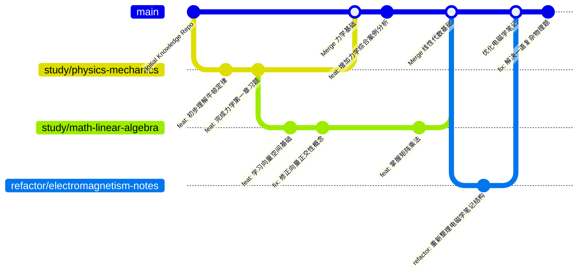
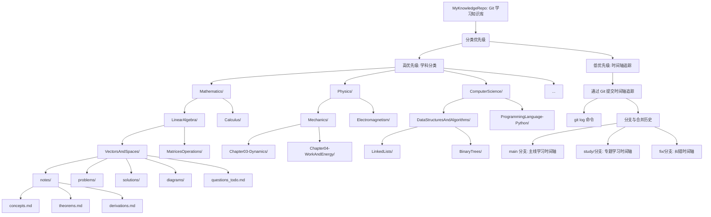

```mermaid
gitGraph
    commit id: "Initial Knowledge Repo"
    branch study/physics-mechanics
    commit id: "feat: 初步理解牛顿定律"
    commit id: "feat: 完成力学第一章习题"
    branch study/math-linear-algebra
    commit id: "feat: 学习向量空间基础"
    commit id: "fix: 修正向量正交性概念"
    checkout main
    merge study/physics-mechanics id: "Merge 力学基础"
    commit id: "feat: 增加力学综合案例分析"
    checkout study/math-linear-algebra
    commit id: "feat: 掌握矩阵乘法"
    checkout main
    merge study/math-linear-algebra id: "Merge 线性代数基础"
    branch refactor/electromagnetism-notes
    commit id: "refactor: 重新整理电磁学笔记结构"
    checkout main
    merge refactor/electromagnetism-notes id: "优化电磁学笔记"
    commit id: "fix: 解决一道复杂物理题"
```
---

```mermaid
graph TD
    A[MyKnowledgeRepo: Git 学习知识库] --> B(分类优先级)

    B --> C1[高优先级: 学科分类]
    B --> C2[低优先级: 时间轴追踪]

    C1 --> D1[Mathematics/]
    C1 --> D2[Physics/]
    C1 --> D3[ComputerScience/]
    C1 --> D4[...]

    D1 --> E1[LinearAlgebra/]
    D1 --> E2[Calculus/]
    D2 --> F1[Mechanics/]
    D2 --> F2[Electromagnetism/]
    D3 --> G1[DataStructuresAndAlgorithms/]
    D3 --> G2[ProgrammingLanguage-Python/]

    E1 --> H1[VectorsAndSpaces/]
    E1 --> H2[MatricesOperations/]
    F1 --> I1[Chapter03-Dynamics/]
    F1 --> I2[Chapter04-WorkAndEnergy/]
    G1 --> J1[LinkedLists/]
    G1 --> J2[BinaryTrees/]

    H1 --> K1[notes/]
    H1 --> K2[problems/]
    H1 --> K3[solutions/]
    H1 --> K4[diagrams/]
    H1 --> K5[questions_todo.md]
    K1 --> L1[concepts.md]
    K1 --> L2[theorems.md]
    K1 --> L3[derivations.md]

    C2 --> M[通过 Git 提交时间轴追踪]
    M --> N[git log 命令]
    M --> O[分支与合并历史]
    O --> P[main 分支: 主线学习时间轴]
    O --> Q[study/分支: 专题学习时间轴]
    O --> R[fix/分支: 纠错时间轴]
```